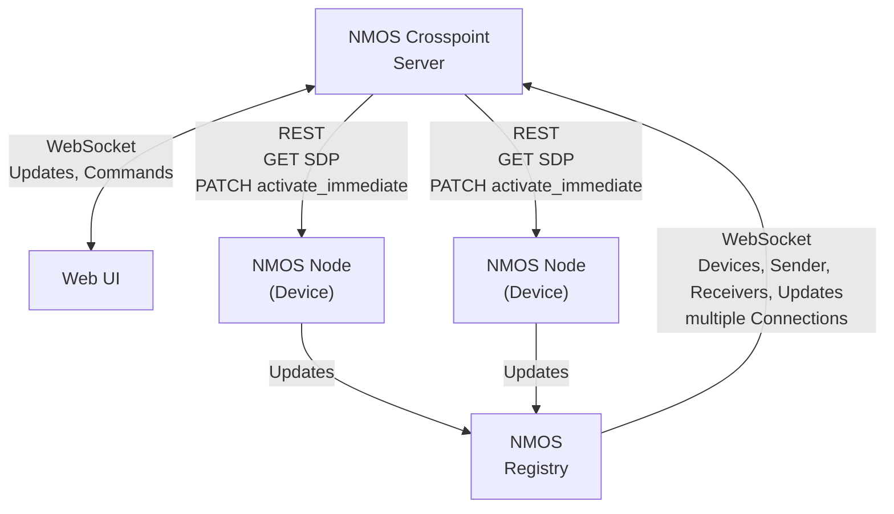

# NMOS Crosspoint Router

High-performance NMOS registry companion and crosspoint router for ST 2110 media networks. The system discovers NMOS devices, maintains a real-time model of senders/receivers/flows, and provides a Web UI + WebSocket API to make connections, manage multicast, and control supported devices.


Tested with 2000+ flows in production-style environments.

## Contents

- [NMOS Crosspoint Router](#nmos-crosspoint-router)
  - [Contents](#contents)
  - [Features](#features)
    - [Core NMOS functionality](#core-nmos-functionality)
    - [Device support](#device-support)
    - [Performance and observability](#performance-and-observability)
    - [External integrations](#external-integrations)
  - [Architecture](#architecture)
    - [Backend](#backend)
    - [Frontend](#frontend)
    - [Device modules](#device-modules)
    - [How it works](#how-it-works)
  - [Getting started](#getting-started)
    - [Deployment (BalenaOS)](#deployment-balenaos)
    - [Local quick start (Docker Compose)](#local-quick-start-docker-compose)
  - [Configuration](#configuration)
    - [Settings](#settings)
    - [Authentication](#authentication)
  - [Web UI routes](#web-ui-routes)
  - [Integrations](#integrations)
    - [Matrox Convert IP](#matrox-convert-ip)
    - [Network switch topology](#network-switch-topology)
    - [Q-SYS](#q-sys)
    - [Bitfocus Companion](#bitfocus-companion)
  - [Monitoring](#monitoring)
  - [Development](#development)
    - [Docker development](#docker-development)
    - [Local development](#local-development)
  - [Troubleshooting](#troubleshooting)
  - [Documentation](#documentation)
  - [License](#license)

## Features

### Core NMOS functionality

- Automatic discovery and real-time monitoring of NMOS nodes, devices, senders, receivers, and flows
- Crosspoint-style switching UI with prepare/preview support
- Multi-registry support across multiple network segments
- Flow management (enable/disable, multicast settings, connection state)
- Automatic reconnection on SDP/flow changes

### Device support

- Matrox Convert IP support (multiviewer toggle, PTP control, device grouping)
- Network switch integration for topology data (Arista DCS, Netgear M4350)
- Pluggable device driver framework for vendor-specific extensions

### Performance and observability

- O(1) device/flow lookup maps for fast switching
- Predictive staging and latency measurement tooling
- Prometheus + Grafana stack (docker-compose)

### External integrations

- WebSocket API for automation and custom UIs
- Q-SYS integration (Lua script)
- Bitfocus Companion workflows

## Architecture

### Backend

`/server`: Node.js + TypeScript.

- Core modules: NMOS connector, crosspoint abstraction, sync server, topology, media device manager
- Real-time sync via WebSocket SyncObjects

### Frontend

`/ui`: Svelte + TypeScript + Tailwind/DaisyUI.

- Real-time updates from SyncObjects and WebSocket API routes

### Device modules

- Media device drivers in `server/src/mediaDevices/`
- Network device drivers in `server/src/networkDevices/`

### How it works



## Getting started

### Deployment (BalenaOS)

Production deployments target BalenaOS. The root `docker-compose.yml` is the Balena service definition, so keep `network_mode: host` enabled for reliable mDNS discovery. Copy `server/config_example` to `server/config`, commit your configuration, and deploy using your normal Balena workflow (CLI or dashboard).

### Local quick start (Docker Compose)

For local testing (non-Balena), you can run the compose stack directly.

1. Copy the example configuration:

```shell
cp -R server/config_example server/config
```

1. Edit the config files in `server/config/` (see [Configuration](#configuration)).
1. Start services:

```shell
docker-compose up
```

1. Open the UI at `http://<host>:80` (or the port configured in `server/config/settings.json`).

Notes:

- The compose file uses `network_mode: host` for reliable mDNS discovery.
- The compose file also starts an NMOS registry, ZeroTier, Prometheus, and Grafana by default. Adjust services as needed.

## Configuration

### Settings

Configuration lives in `server/config/` (copied from `server/config_example`). Key files:

- `server/config/settings.json` — server ports, NMOS registry versions, multicast ranges, debug flags
- `server/config/users.json` — authentication and permissions
- `server/config/topology.json` — network switch definitions (optional)
- `server/config/mediadev_matroxcip/matroxcip.json` — Matrox Convert IP settings

Example (settings.json):

```json
{
  "server": {"port": 80, "address": "0.0.0.0"},
  "staticNmosRegistries": [{"ip": "10.1.0.211", "port": 80, "priority": 10, "domain": ""}],
  "nmos": {"registryVersions": ["v1.3", "v1.2"], "connectVersions": ["v1.1", "v1.0"]}
}
```

### Authentication

Authentication is configured in `server/config/users.json` using SHA256 password hashes. Example:

```json
{
  "users": {"admin": {"password": "<sha256>", "groups": ["user", "admin"]}},
  "permissions": {"global": {"allowRead": {"users": ["__noAuth"], "groups": ["user"]}}}
}
```

Known issue: unauthenticated access is currently blocked in some builds, so set at least one user/password in `users.json`.

## Web UI routes

- `/` or `/crosspoint` — crosspoint matrix view
- `/details` — device details and flow management
- `/topology` — network topology view
- `/setup` — configuration and status
- `/mediadevices` — media device overview
- `/mediadevices/matroxcip` — Matrox Convert IP controls
- `/mediadevices/riedelembrionix` — Riedel Embrionix controls
- `/debug` — live NMOS/crosspoint data
- `/logging` — server logs while making connections

## Integrations

### Matrox Convert IP

Configuration: `server/config/mediadev_matroxcip/matroxcip.json`.

Credential overrides via environment variables:

- `MATROX_CIP_USER`
- `MATROX_CIP_PASSWORD`

Supported controls include multiviewer enable/disable and PTP enable/disable. See `docs/WEBSOCKET_API.md` for API routes.

### Network switch topology

Define devices in `server/config/topology.json` to pull interface and LLDP data into the topology view (e.g., Arista DCS, Netgear M4350).

### Q-SYS

Use the Lua script in `scripts/q-sys-crosspoint-control.lua` for Q-SYS control system integration. Setup details and examples are in `scripts/README.md`.

### Bitfocus Companion

Bitfocus Companion workflows are supported via the WebSocket API. See the Companion integration notes in `docs/NMOS_COMMANDS.md`.

## Monitoring

The default compose stack includes Prometheus and Grafana for latency metrics and performance monitoring. With `network_mode: host`, they use standard ports (Grafana 3000, Prometheus 9090) unless changed.

### InfluxDB (Proxmox metrics)

The stack can also run InfluxDB 2.x for Proxmox host metrics. InfluxDB data is persisted via the `influxdb2-data` and `influxdb2-config` volumes (Balena keeps these across redeploys).

**InfluxDB init env vars** (set in Balena Cloud for the `influxdb` service):

- `DOCKER_INFLUXDB_INIT_USERNAME`
- `DOCKER_INFLUXDB_INIT_PASSWORD`
- `DOCKER_INFLUXDB_INIT_ORG`
- `DOCKER_INFLUXDB_INIT_BUCKET` (default: `proxmox`)
- `DOCKER_INFLUXDB_INIT_ADMIN_TOKEN`

> Note: these init values apply **only on first boot** (when `/var/lib/influxdb2` is empty). After that, change tokens/users in the InfluxDB UI.

**Grafana datasource provisioning** is defined in:

`monitoring/grafana/provisioning/datasources/influxdb.yml`

Set these **Grafana service** env vars in Balena Cloud:

- `INFLUXDB_URL` (e.g. `http://localhost:8086`)
- `INFLUXDB_ORG`
- `INFLUXDB_BUCKET`
- `INFLUXDB_TOKEN`

Restart the Grafana service to apply provisioning.

## Development

### Docker development

```shell
docker-compose up nmos-crosspoint-dev
```

### Local development

```shell
cd ui
npm install
npm run dev

cd ../server
npm install
npm run dev
```

See [Web UI routes](#web-ui-routes) for `/debug` and `/logging` while developing.

## Troubleshooting

- **Missing state folders**: If startup logs mention missing state folders, create `server/state` and the subfolders named in the warnings.
- **mDNS discovery**: Docker deployments require host networking for reliable discovery.
- **Unauthenticated access**: Add a user/password in `server/config/users.json` if login fails without credentials.

## Documentation

- WebSocket API: `docs/WEBSOCKET_API.md`
- NMOS command reference: `docs/NMOS_COMMANDS.md`
- Q-SYS integration guide: `scripts/README.md`

## License

MIT
